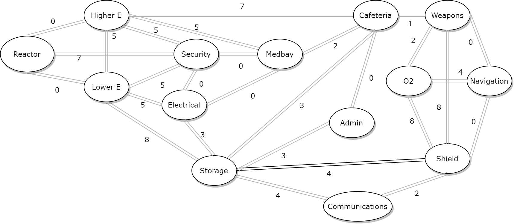

## Step 1: To organize the tournament

1. To represent a player and its score, we are going to use a class with the properties:
- Name
- Score
- Left neighbor (in the tree)
- Right neighbor (in the tree)

2. The most optimized data structure for the tournament is an AVL tree because it has a log complexity to reach an element which corresponds to a score.

3. To randomize the players score at each game, we set probabilities for each event of the game:
- a $\frac{1}{5}$ chance for a player to be an impostor
  - the impostors get 10 points both if they win ($\frac{1}{3}$ probability), 5 points for each crewmate if they lose
  - for each murder (random number between 0 and 4)
    - we add 1 to the score of the impostor if the murder is discovered ($\frac{1}{4}$), 3 otherwise
  - if a crewmate has done all its tasks ($\frac{1}{2}$) probability, he gets 1 point
  - if a crewmate unmasks an impostor, he gets 3 points (random number between 0 and 2)
- a $\frac{1}{2}$ chance to win the game

4. To update the player's score and the database, we create a new AVL Tree and insert the players in it. After the 3 initial random games, we delete the worst 10  players each turn.

5. 6. 7. We use a `game` function that:

- calls the `score` (random score function) and builds new AVL trees
- removes the 10 last players
- calls itself recursively while the number of players is superior to 10.

Once we only have 10 players, we call the `final` function with the last database.

8. We made a `final` function that simulates 5 games. Once the games are finished, we do the following while there are players in the database:
- we print the name and score first player of the inorder traversal of the database
- we delete this player from the database

```{sh, eval=FALSE}
python3 ../Step1/among_us.py
```

```
##
## The final !
##
##
## Game number 5
##
## The finalist, player 45 has a score of 3
## The finalist, player 2 has a score of 17
## The finalist, player 96 has a score of 5
## The finalist, player 20 has a score of 15
## The finalist, player 38 has a score of 8
## The finalist, player 86 has a score of 8
## The finalist, player 15 has a score of 18
## The finalist, impostor 19 has a score of 16
## The finalist, player 24 has a score of 6
## The finalist, impostor 56 has a score of 6
##
## Podium :
## 10 : Player 45 - 3 points
## 9 : Player 96 - 5 points
## 8 : Player 56 - 6 points
## 7 : Player 24 - 6 points
## 6 : Player 86 - 8 points
## 5 : Player 38 - 8 points
## 4 : Player 20 - 15 points
## 3 : Player 19 - 16 points
## 2 : Player 2 - 17 points
## 1 : Player 15 - 18 points
```

\pagebreak

## Step 2: Professor Layton < Guybrush Threepwood < You


1. To represent the relation (have seen) between players, we have chosen to do an array of arrays (adjacency matrix), which is the easiest way to represent undirected graphs.

2. We did not know which graph theory problem could be used, so we created a "brute-force" algorithm:

```
suspects = {1, 4, 5}
players = {1, 2, 3, 4, 5, 6, 7, 8, 9, 10}
for each suspect in suspects:
  neighbors = {}
  for each player in players:
    # if player saw the suspect
    if graph[player][suspect] == 1:
      add player to neighbors
  candidates = players - suspects - neighbors
```

However, this algorithm has a bad complexity ($O(n^2)$) and more efficient ones must exist.

3. In order to predict who is the second impostor, we are going to go through each suspected impostor (1, 4 or 5) and exclude their neighbors.

4. 

```{sh}
python3 ../Step2/imposters.py
```

\pagebreak

## Step 3: I don't see him, but I can give proofs he vents!

1. We have chosen an undirected graph for each map, because the distance is the same both ways.




2. We have chosen the Floyd-Warshal algorithm, because we do not have any strictly negative distances and we are interested in looking at the minimum distances between each pair of rooms. For example, if we had chosen the Dijkstra algorithm, we would have needed to calculate the minimum distance for every pair (double for loop: $O(n^2)$ complexity).

3. 4. 

Distances for the crewmates:
```
         1   2   3   4   5   6   7   8   9   10  11  12  13  14
Room 1	[0,  5,  5,  3,  10, 10, 12, 13, 15, 13, 18, 15, 16, 17]
Room 2	[5,  0,  7,  5,  5,  12, 7,  10, 10, 8,  13, 10, 11, 13]
Room 3	[5,  7,  0,  5,  12, 5,  11, 8,  11, 12, 17, 14, 12, 12]
Room 4	[3,  5,  5,  0,  10, 10, 12, 13, 15, 13, 18, 15, 16, 17]
Room 5	[10, 5,  12, 10, 0,  8,  2,  5,  5,  3,  8,  5,  6,  8]
Room 6	[10, 12, 5,  10, 8,  0,  6,  3,  6,  7,  12, 9,  7,  7]
Room 7	[12, 7,  11, 12, 2,  6,  0,  3,  3,  1,  6,  3,  4,  6]
Room 8	[13, 10, 8,  13, 5,  3,  3,  0,  3,  4,  9,  6,  4,  4]
Room 9	[15, 10, 11, 15, 5,  6,  3,  3,  0,  4,  9,  6,  7,  7]
Room 10	[13, 8,  12, 13, 3,  7,  1,  4,  4,  0,  5,  2,  3,  5]
Room 11	[18, 13, 17, 18, 8,  12, 6,  9,  9,  5,  0,  4,  6,  8]
Room 12	[15, 10, 14, 15, 5,  9,  3,  6,  6,  2,  4,  0,  5,  7]
Room 13	[16, 11, 12, 16, 6,  7,  4,  4,  7,  3,  6,  5,  0,  2]
Room 14	[17, 13, 12, 17, 8,  7,  6,  4,  7,  5,  8,  7,  2,  0]
```

Distances for the impostors:
```
         1  2  3  4  5  6  7  8  9 10 11 12 13 14
Room 1	[0, 0, 0, 3, 3, 3, 5, 6, 5, 6, 6, 8, 6, 8]
Room 2	[0, 0, 0, 3, 3, 3, 5, 6, 5, 6, 6, 8, 6, 8]
Room 3	[0, 0, 0, 3, 3, 3, 5, 6, 5, 6, 6, 8, 6, 8]
Room 4	[3, 3, 3, 0, 0, 0, 2, 3, 2, 3, 3, 5, 3, 5]
Room 5	[3, 3, 3, 0, 0, 0, 2, 3, 2, 3, 3, 5, 3, 5]
Room 6	[3, 3, 3, 0, 0, 0, 2, 3, 2, 3, 3, 5, 3, 5]
Room 7	[5, 5, 5, 2, 2, 2, 0, 3, 0, 1, 1, 3, 1, 3]
Room 8	[6, 6, 6, 3, 3, 3, 3, 0, 3, 4, 4, 6, 4, 4]
Room 9	[5, 5, 5, 2, 2, 2, 0, 3, 0, 1, 1, 3, 1, 3]
Room 10	[6, 6, 6, 3, 3, 3, 1, 4, 1, 0, 0, 2, 0, 2]
Room 11	[6, 6, 6, 3, 3, 3, 1, 4, 1, 0, 0, 2, 0, 2]
Room 12	[8, 8, 8, 5, 5, 5, 3, 6, 3, 2, 2, 0, 2, 4]
Room 13	[6, 6, 6, 3, 3, 3, 1, 4, 1, 0, 0, 2, 0, 2]
Room 14	[8, 8, 8, 5, 5, 5, 3, 4, 3, 2, 2, 4, 2, 0]
```

\pagebreak

## Step 4: Secure the last tasks

1. We chose to represent the graph with a dictionnary: this will make implementing the Hamilton algorithm easier.

2. Finding a route passing through each room only one time is a graph theory problem called the Hamiltonian path problem.

3. We implemented a recursive algorithm: however, if we try to run this algorithm starting from the Cafeteria room we notice that the problem cannot be solved, because there is a cycle (it is not possible to visit every room only one time: the cafeteria has to be visited twice).

Here is the pseudocode:

```
function hamiltonian_path(graph, vertex, path):
  if vertex is not in path:
    add vertex to path
    
    if length(path) == lenth(graph):
      return path
      
    for each neighbor of vertex:
      candidate = hamiltonian_path(graph, neighbor, path)
      if candidate exists:
        return candidate
```

4. Execution starting from the Medbay room.

```{sh}
python3 ../Step4/hamiltonian_path.py
```


